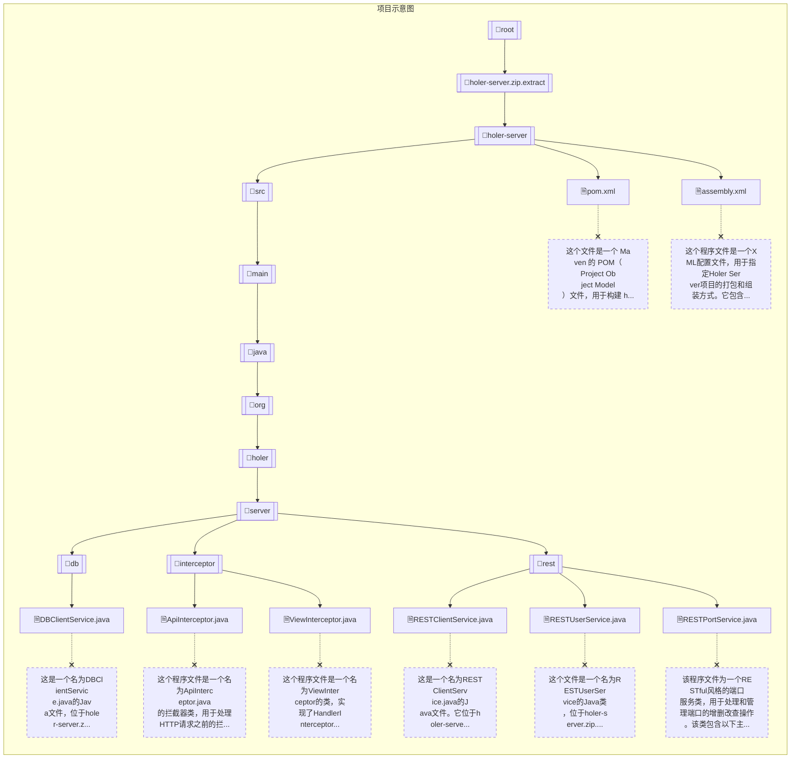

# holer-server项目解读

## [1/40]程序文件概述: holer-server/src/main/java/org/holer/server/HolerApp.java

该文件是holer-server项目的主要入口文件。主要作用是启动Holer服务器，并且设置服务器的启动参数和端口。文件中的关键部分包括：

- 使用了`@SpringBootApplication`注解来指定该类是Spring Boot应用的入口。
- 使用了`@EnableScheduling`注解来启用定时任务的支持。
- `main`方法是应用程序的入口点，通过`SpringApplication.run(HolerApp.class, args)`来启动Spring Boot应用程序。
- 通过`ServerUtil.property(ServerConst.SERVER_PORT)`获取服务器端口。
- 通过`ServerContainer.getContainer().start()`启动ServerContainer实例。
- 最后通过日志记录服务器启动的端口信息。

该文件主要负责启动Holer服务器并初始化相关配置，然后启动ServerContainer来处理请求。

## [2/40]程序文件概述: holer-server/src/main/java/org/holer/server/handler/ExceptHandler.java

该程序文件是一个Java类文件，位于holer-server/src/main/java/org/holer/server/handler/ExceptHandler.java。该文件定义了一个异常处理器类ExceptHandler，用于处理不同类型的异常。

该类使用@RestControllerAdvice注解标记为一个全局异常处理类，可以处理控制器中抛出的异常。

在该类中，定义了三个异常处理方法：
1. handle(Exception e)方法用于处理通用的Exception异常，打印异常信息并返回一个HolerResult对象，该对象包含一个错误代码和错误信息。
2. handle(MethodArgumentNotValidException e)方法用于处理参数校验异常，获取校验失败的字段错误信息并拼接为一个错误信息字符串，然后返回一个HolerResult对象，该对象包含一个错误代码和错误信息。
3. handle(HolerException e)方法用于处理自定义的HolerException异常，直接返回一个HolerResult对象，该对象包含自定义异常中的错误代码。

通过这些异常处理方法，程序可以在发生异常时进行捕获、处理和返回错误信息，提高系统的可靠性和可维护性。

## [3/40]程序文件概述: holer-server/src/main/java/org/holer/server/handler/ExtraClientHandler.java

该文件是holer项目中的一个Java源代码文件，路径为holer-server/src/main/java/org/holer/server/handler/ExtraClientHandler.java。它是一个Netty的事件处理器类，继承自SimpleChannelInboundHandler<ByteBuf>。它包含了处理客户端连接和数据传输的方法，包括exceptionCaught、channelRead0、channelActive、channelInactive和channelWritabilityChanged等方法。这些方法分别用于处理出现异常、接收数据、客户端连接建立、客户端连接断开和可写性变化等事件。

## [4/40]程序文件概述: holer-server/src/main/java/org/holer/server/handler/DataHandler.java

这个程序文件是`DataHandler.java`，它位于`holer-server/src/main/java/org/holer/server/handler`路径下。

该文件是一个Java类，它是一个Netty的`ChannelDuplexHandler`的子类。它实现了`channelRead`、`write`、`channelActive`和`channelInactive`方法。

`channelRead`方法在读取数据后会更新`DataCollector`对象中的统计信息，并将消息传递给下一个处理器。
`write`方法在写入数据后会更新`DataCollector`对象中的统计信息，并继续执行后续的写操作。
`channelActive`方法在连接激活时会增加`DataCollector`对象中的连接数。
`channelInactive`方法在连接失效时会减少`DataCollector`对象中的连接数。

该类的主要功能是通过`DataCollector`收集和统计连接的读写数据量，并跟踪连接数。

## [5/40]程序文件概述: holer-server/src/main/java/org/holer/server/handler/ServerHandler.java

该文件是holer-server项目中的一个处理程序类，用于处理服务器收到的消息。主要包括以下几个方法：

1. exceptionCaught方法：捕获holer客户端的异常，并打印日志。
2. channelRead0方法：处理接收到的消息，根据消息类型不同采取不同的处理方式。
3. channelWritabilityChanged方法：当可写状态发生变化时，将该状态同步到关联的通道。
4. channelInactive方法：当通道不再活动时，进行一些清理工作，如移除通道的引用及关闭相关通道。
5. handleHeartbeatMsg方法：处理心跳消息，通知客户端已接收到该消息。
6. handleAuthMsg方法：处理客户端认证消息，进行认证操作。
7. handleConnectMsg方法：处理连接消息，建立与目标服务器的连接。
8. handleDisconnectMsg方法：处理断开连接消息，关闭与目标服务器的连接。
9. handleTransferMsg方法：处理数据传输消息，将数据传输到目标服务器。

该类主要功能是根据接收到的消息类型执行相应的操作，如认证、连接、断开连接和数据传输等。

## [6/40]程序文件概述: holer-server/src/main/java/org/holer/server/init/ServerInitializer.java

该文件是一个Java类文件，位于holer-server/src/main/java/org/holer/server/init/目录下。它是一个netty的服务器初始化类，继承了ChannelInitializer<SocketChannel>类。在initChannel方法中，根据参数sslEnabled的值来判断是否开启SSL加密，并根据需要配置SSL引擎，然后添加一系列的管道处理器，包括消息解码器、消息编码器、空闲检测器和服务器处理器。

## [7/40]程序文件概述: holer-server/src/main/java/org/holer/server/init/ExtraClientInitializer.java

这是一个名为ExtraClientInitializer.java的文件，位于holer-server/src/main/java/org/holer/server/init/目录下。这个文件是一个Netty的ChannelInitializer子类，用来初始化SocketChannel的管道。

在initChannel方法中，会依次向管道添加一个DataHandler和一个ExtraClientHandler，用于处理数据和额外的客户端请求。

## [8/40]程序文件概述: holer-server/src/main/java/org/holer/server/h2/H2Function.java

这是一个名为H2Function.java的Java程序文件，位于holer-server/src/main/java/org/holer/server/h2目录下。它是一个H2数据库函数类，包含了一个名为unixTimeStamp的静态方法，参数为一个Timestamp对象，返回一个整数类型结果。该方法将给定的Timestamp对象转换为Unix时间戳。

## [9/40]程序文件概述: holer-server/src/main/java/org/holer/server/util/DataCollector.java

这是一个名为DataCollector的Java类，它位于org.holer.server.util包中。该类用于收集和管理数据，并提供方法来访问和操作收集到的数据。

该类包含以下成员变量：
- collectors：一个ConcurrentHashMap，用于存储不同端口的DataCollector实例。
- port：表示当前DataCollector实例所监听的端口。
- readBytes：一个AtomicLong类型的对象，用于记录读取的字节数。
- wroteBytes：一个AtomicLong类型的对象，用于记录写入的字节数。
- readMsgs：一个AtomicLong类型的对象，用于记录读取的消息数量。
- wroteMsgs：一个AtomicLong类型的对象，用于记录写入的消息数量。
- channels：一个AtomicInteger类型的对象，用于记录当前连接的通道数量。

该类包含以下方法：
- getCollector(Integer port)：根据端口获取对应的DataCollector实例。
- getInitAllData()：获取所有DataCollector实例的初始数据。
- getAllData()：获取所有DataCollector实例的当前数据。
- getInitData()：获取当前DataCollector实例的初始数据。
- getData()：获取当前DataCollector实例的当前数据。
- incrementReadBytes(long bytes)：增加读取的字节数。
- incrementWroteBytes(long bytes)：增加写入的字节数。
- incrementReadMsgs(long msgs)：增加读取消息的数量。
- incrementWroteMsgs(long msgs)：增加写入消息的数量。
- getChannels()：获取当前连接的通道数量。
- getPort()：获取当前DataCollector实例监听的端口。
- setPort(Integer port)：设置当前DataCollector实例监听的端口。

总体而言，该类用于收集和统计与端口相关的数据，并提供了访问和操作这些数据的方法。

## [10/40]程序文件概述: holer-server/src/main/java/org/holer/server/util/ServerUtil.java

这个程序文件是一个名为ServerUtil的工具类。它包含了一些静态方法和实例方法，用来提供服务器相关的实用功能。这个类使用了一些第三方库，如Jackson、Gson和OkHttp，还依赖了一些其他的类和接口。它还被声明为一个Spring的组件(Component)，可以被自动装配到其他类中使用。整个文件包括了一些公共方法，如初始化方法、获取服务方法、验证方法、写方法等。这些方法用来处理各种服务器相关的功能，如用户验证、生成随机ID、验证许可证、获取总端口数量等。

## [11/40]程序文件概述: holer-server/src/main/java/org/holer/server/util/ServerMgr.java

该文件是一个名为ServerMgr的Java类，主要包含了一些静态变量和静态方法。其中静态变量包括bindChannels、holerChannels、trialClients、extraClientId等Map类型的变量，以及webServerPort、serverDomain、serverHost、serverPort、proxyContent等一些基本类型的变量。静态方法包括isSslServerEnable、getSslServerHost、getSslServerPort等获取静态变量值的方法，以及initCfg、initHoler、saveClient、savePort等一些用于初始化配置和保存数据的方法。此外，还有一些其他的辅助方法，如bind、unbind、deleteProxy等。整体来说，该类是一个服务器管理工具类，用于管理服务器的状态、配置和通讯等。

## [12/40]程序文件概述: holer-server/src/main/java/org/holer/server/config/SchedulerConfig.java

这是一个名为SchedulerConfig的Java类文件，位于`holer-server/src/main/java/org/holer/server/config/`路径下。该类使用了Spring框架的注解`@Configuration`，用于标识为配置类。实现了`SchedulingConfigurer`接口，用于自定义任务调度器的配置。

在`configureTasks`方法中，创建了一个`ThreadPoolTaskScheduler`对象，并进行了一些配置，如设置线程池大小为5，线程名前缀为"Holer-Task-"。然后调用`initialize`方法进行初始化。最后通过`registrar.setTaskScheduler(taskScheduler)`方法将配置好的任务调度器设置到`ScheduledTaskRegistrar`对象中。

该配置类的主要作用是创建和配置一个自定义的任务调度器，并将其应用于任务注册器中，以便在Spring应用程序中实现定时任务调度。

## [13/40]程序文件概述: holer-server/src/main/java/org/holer/server/config/HolerWebConfig.java

这是一个名为HolerWebConfig.java的配置文件，位于org.holer.server.config包中。它实现了WebMvcConfigurer接口，并覆盖了addInterceptors方法。该方法通过向注册表添加拦截器来配置拦截器。文件中还有两个注入的拦截器实例：apiInterceptor和viewInterceptor。addInterceptors方法使用这两个拦截器，并为它们指定了拦截路径。apiInterceptor拦截/api/**路径，viewInterceptor拦截/view/**路径。

## [14/40]程序文件概述: holer-server/src/main/java/org/holer/server/config/CorsConfig.java

这个文件是"Holer Server"项目中的一个配置文件，它用于配置跨域资源共享（CORS）功能。该文件定义了一个 CorsConfig 类，被注解为@Configuration，表示这是一个Spring应用程序的配置类。在这个类中，有一个@Bean方法，它创建了一个CorsFilter对象，并返回它。CorsFilter是Spring框架中的一个过滤器，用于处理跨域请求。在这个方法中，我们创建了一个CorsConfiguration对象，并设置了一些允许访问的来源、头部和方法。然后，创建了一个UrlBasedCorsConfigurationSource对象，将CorsConfiguration配置应用到所有的URL路径上。最后，将UrlBasedCorsConfigurationSource对象传递给CorsFilter构造函数，创建CorsFilter对象并返回。这样，当请求到达服务器时，CorsFilter将会根据CorsConfiguration的设置来处理跨域请求。

## [15/40]程序文件概述: holer-server/src/main/java/org/holer/server/timer/HolerWorker.java

该程序文件名为HolerWorker.java，位于org.holer.server.timer包下。这个文件是一个定时任务类，包含了三个定时任务方法cleanExpiredData()、closeHoler()和setDomain()。cleanExpiredData()方法用于清除过期的数据；closeHoler()方法用于关闭Holer；setDomain()方法用于设置域名。这个类使用了Spring的Scheduled注解来指定定时执行的时间间隔。文件中还引入了一些其他的类和工具类，并且使用了日志输出。

## [16/40]程序文件概述: holer-server/src/main/java/org/holer/server/container/ServerContainer.java

该程序文件是Holer服务器的主要容器类，用于启动和停止服务器。以下是该文件的关键要点：

1. 该类位于org.holer.server.container包中。
2. 使用了Netty库来构建服务器。
3. 该类是单例模式实现的，通过getContainer()方法获取唯一实例。
4. 拥有两个NioEventLoopGroup实例，一个用于处理网络请求的工作线程组，一个用于监听新连接的Boss线程组。
5. ServerContainer类的构造函数调用了init()方法来初始化工作线程组和Boss线程组。
6. 使用ServerBootstrap实例来配置服务器的基本参数，如工作线程组、通道类型和处理器。
7. 通过listenPort()方法绑定一个指定的端口号。
8. 通过listenPorts()方法监听所有配置的端口号。
9. 有一个newServer()方法用于创建一个新的ServerBootstrap实例。
10. 通过start()方法启动服务器，在指定的主机和端口上监听新连接。
11. 通过stop()方法停止服务器，优雅地关闭工作线程组和Boss线程组。

总结：ServerContainer类是Holer服务器的核心容器类，负责处理服务器的启动和停止。它使用Netty库提供的API实现了一个基本的服务器框架，并通过单例模式确保全局唯一性。

## [17/40]程序文件概述: holer-server/src/main/java/org/holer/server/constant/HolerType.java

该程序文件是一个Java枚举类，命名为HolerType。该枚举类定义了一些常见的网络协议类型，如HTTP、HTTPS、SSH等。每个协议类型都有一个与之对应的字符串类型（type属性），并提供了一个value方法用于获取该字符串类型。此外，该枚举类还提供了一个isValid方法，用于检查给定的字符串是否为有效的协议类型。

## [18/40]程序文件概述: holer-server/src/main/java/org/holer/server/constant/ServerConst.java

该文件是一个Java类文件，位于org.holer.server.constant包下。该类中定义了一系列用于服务器的常量字段。

其中一些常量的含义如下：
- EXTRA_CLIENTS：用于存储额外客户端的Netty Channel对象的AttributeKey。
- OS_TYPE：操作系统类型，通过System.getProperty("os.name")获取。
- SSL：字符串常量，表示SSL。
- HOLER：字符串常量，表示Holer。
- DOMAIN：表示域名。
- PORT：表示端口号。
- PROTOCOL：表示协议。
- LISTEN_PORT：监听端口。
- PROXY_CONF：代理配置文件路径。
- HOLER_CONF：Holer配置文件路径。
- NGINX_CONF：Nginx配置文件路径。
- HOLER_SSL_JKS：Holer SSL证书密钥库路径。
- CONF：配置文件路径。
- NGINX_SSL：Nginx SSL。
- HTTP：表示HTTP协议。
- HTTPS：表示HTTPS协议。
- HTTPS_PORT：HTTPS端口号。
- HTTP_PORT：HTTP端口号。
- SSL_CRT：SSL证书。
- DOMAIN_RULE：域名的正则表达式规则。
- KEY_RULE：密钥的正则表达式规则。
- SERVER_RULE：服务器地址的正则表达式规则。
- EMAIL_RULE：邮箱的正则表达式规则。
- SERVER_MSG：服务器消息配置文件路径。
- TOKEN：身份验证令牌。
- VIEW_LOGIN：登录页面路径。
- MAX_EXTRA_CLIENTS：最大额外客户端数。
- MAX_PORT：最大端口号。
- MIN_PORT：最小端口号。
- MAX_DAY：最大天数。
- DEFAULT_VALID_DAY：默认有效天数。
- DEFAULT_DOMAIN：默认域名。
- WISDOM_DOMAIN：智能域名。
- ONLINE：在线状态。
- OFFLINE：离线状态。
- ONE_KB：1KB。
- DEFAULT_HTTP_PORT：默认HTTP端口号。
- API_PREFIX：API前缀。
- LICENSE：许可证。
- KEY：密钥。
- NGINX_RELOAD：Nginx重新加载命令。
- INCLUDE_CONF：Nginx配置文件中的include语句。
- WEB_SERVER_PORT：Web服务器端口。
- SERVER_DOMAIN：服务器域名。
- SERVER_HOST：服务器主机。
- SERVER_PORT：服务器端口。
- SSLSERVER_ENABLE：SSL服务器是否启用。
- SSLSERVER_HOST：SSL服务器主机。
- SSLSERVER_PORT：SSL服务器端口。
- HOLER_DOMAIN_NAME：Holer域名。
- HOLER_SERIAL_NO：Holer许可证序列号。
- HOLER_NGINX_BIN：Holer中Nginx可执行文件的路径。
- HOLER_NGINX_CONF：Holer中Nginx配置文件的路径。
- HOLER_NGINX_HOME：Holer中Nginx的安装目录。

## [19/40]程序文件概述: holer-server/src/main/java/org/holer/server/constant/HolerCode.java

这是一个名为HolerCode.java的文件，位于src/main/java/org/holer/server/constant/路径下。这个文件定义了一个枚举类型HolerCode，包含了许多常量成员。每个常量成员都有一个对应的整数值，并通过构造函数进行初始化。HolerCode还提供了两个方法：value()用于获取常量成员的整数值，message()用于获取常量成员对应的消息文本。

## [20/40]程序文件概述: holer-server/src/main/java/org/holer/server/model/HolerLicense.java

这个程序文件名为HolerLicense.java，位于org.holer.server.model包下的src/main/java目录中。它是一个Java类文件，用于定义HolerLicense对象的模型。

这个类使用了lombok库的@Data注解，自动生成了getter和setter方法。它实现了Serializable接口，表示可以被序列化。

HolerLicense类有以下成员变量：
- licenseId：Long类型，表示许可证ID
- userName：String类型，表示用户名
- serialNum：String类型，表示序列号
- validDay：Long类型，表示有效期天数
- expireAt：String类型，表示过期时间
- createAt：Long类型，表示创建时间
- portNum：Long类型，表示端口号

这个类的作用是表示一个Holer许可证对象，并提供相关的属性和方法。这个类可用于在Holer服务器中存储和处理许可证信息。

## [21/40]程序文件概述: holer-server/src/main/java/org/holer/server/model/HolerPort.java

这个文件是一个Java类文件，文件名为HolerPort.java。该类位于org.holer.server.model包。它是一个实体类，用于映射数据库表holer_port。该类定义了一些属性和方法，用于描述Holer服务器的端口信息，包括访问密钥(accessKey)、端口号(portNum)、服务器地址(server)、域名(domain)、Holer类型(type)等。该类还提供了一些辅助方法，用于计算有效天数(validDay)、过期时间(expireAt)、创建时间(createAt)和获取IP地址(inetAddr)。

## [22/40]程序文件概述: holer-server/src/main/java/org/holer/server/model/HolerStatus.java

该文件是一个Java类文件，位于项目的holer-server模块中的org.holer.server.model包下。该类是一个数据模型类，用于表示Holer的状态。

该类使用了lombok库的@Data注解，自动生成了属性的getter、setter方法、equals()、hashCode()、toString()等方法。

HolerStatus类有以下属性：
- code：一个整数，用于表示状态码。该属性被标注为不序列化和不反序列化。
- msg：一个字符串，用于表示状态信息。该属性被标注为不序列化和不反序列化。
- msgZhCN：一个字符串，用于表示中文状态信息。该属性会被序列化和反序列化，并使用SerializedName注解指定了序列化后的名称。
- msgEnUS：一个字符串，用于表示英文状态信息。该属性会被序列化和反序列化，并使用SerializedName注解指定了序列化后的名称。

## [23/40]程序文件概述: holer-server/src/main/java/org/holer/server/model/HolerClient.java

这个程序文件是holer-server项目的一部分。它定义了一个HolerClient类，在数据库表holer_client中映射了多个属性。该类实现了Serializable接口，并使用lombok库的@Data注解自动生成了getter和setter方法。HoldeClient类具有以下属性：clientId、name、accessKey、enabled、status、onlineAt、channel、ports。其中，clientId是自动生成的唯一标识符，name是一个非空且符合邮箱格式的字符串，accessKey是一个字符串，enabled是一个布尔值，status是一个整数。onlineAt和channel属性被标记为@Transient和@JsonIgnore，并不会在数据库中存储，而是用于临时存储数据。ports属性是一个HolerPort对象的列表。此外，类还包括一些方法，如publicPorts方法返回一个整数列表，并遍历ports列表以获取端口号。

## [24/40]程序文件概述: holer-server/src/main/java/org/holer/server/model/HolerUser.java

该程序文件是一个Java类文件，名为HolerUser.java。该类位于org.holer.server.model包下。该类使用了Lombok库的@Data注解，以自动生成getter和setter方法。该类是一个实体类，使用了javax.persistence注解进行标注，以与数据库表holer_user进行映射。该类实现了Serializable接口，以支持序列化。类中包含了字段userId、name、password和token，分别表示用户id、用户名、密码和令牌。其中name字段使用了javax.validation.constraints注解进行验证，要求值不能为空且长度在3到128个字符之间；password字段也使用了javax.validation.constraints注解进行验证，要求值不能为空且长度在6到128个字符之间。

## [25/40]程序文件概述: holer-server/src/main/java/org/holer/server/model/HolerData.java

这个程序文件是holer-server项目中的一个Java类文件，文件名是HolerData.java。这个类是一个POJO类，用于表示Holer服务器中的数据信息。它实现了java.io.Serializable接口，以便在网络传输和持久化存储过程中进行序列化和反序列化。

这个类有以下属性：
- port (int类型): 表示服务器端口号
- readBytes (long类型): 表示从客户端读取的字节数
- wroteBytes (long类型): 表示向客户端写入的字节数
- readMsgs (long类型): 表示已读取消息数
- wroteMsgs (long类型): 表示已写入消息数
- channels (int类型): 表示当前连接的通道数
- timestamp (long类型): 表示时间戳

这个类使用了Lombok库中的@Data注解，自动生成了属性的getter和setter方法、toString方法等。

## [26/40]程序文件概述: holer-server/src/main/java/org/holer/server/model/HolerResult.java

该源代码文件是一个名为HolerResult的Java类，位于org.holer.server.model包中。它具有以下属性和方法：

属性：
- code：整数类型，表示返回结果的代码。
- msg：字符串类型，表示返回结果的信息。
- data：泛型T，表示返回结果的数据。
- total：长整型，表示返回结果的总数。

构造方法：
- HolerResult(Integer code)：根据给定代码初始化结果对象，使用ServerUtil类获取代码对应的状态信息。
- HolerResult(Integer code, String msg)：使用给定的代码和信息初始化结果对象。
- HolerResult(HolerCode code)：根据给定的HolerCode枚举值初始化结果对象，使用ServerUtil类获取代码对应的状态信息。
- HolerResult(Page<?> page, HolerCode code)：根据给定的Page对象和HolerCode枚举值初始化结果对象，将Page对象的内容设置为结果对象的数据，并使用ServerUtil类获取代码对应的状态信息。
- HolerResult(T data, HolerCode code)：根据给定的数据和HolerCode枚举值初始化结果对象，将数据设置为结果对象的数据，并使用ServerUtil类获取代码对应的状态信息。

重要方法：
- 无。

使用注解：
- @Data：使用Lombok库生成getter、setter、hashCode、equals等方法。

## [27/40]程序文件概述: holer-server/src/main/java/org/holer/server/model/HolerException.java

这个程序文件是holer-server项目中的一个Java类文件，文件名为HolerException.java。该类继承了RuntimeException类。它定义了一个HolerException异常，主要用于包装HolerCode和HolerStatus，提供了一些方法来获取异常的状态信息。该文件主要用于处理holer-server项目中的异常情况。

## [28/40]程序文件概述: holer-server/src/main/java/org/holer/server/model/HolerReport.java

这个程序文件是holer-server项目中的一个Java类文件，文件名为HolerReport.java。它位于`holer-server/src/main/java/org/holer/server/model/`目录下。

该类使用了Lombok的@Data注解，自动生成了getter和setter方法。它实现了Serializable接口，并包含以下属性：

- onlineClient: 在线客户端数量
- offlineClient: 离线客户端数量
- enabledClient: 启用的客户端数量
- disabledClient: 禁用的客户端数量
- expiredPort: 过期的端口数量
- unexpiredPort: 未过期的端口数量
- activePort: 活跃的端口数量
- inactivePort: 不活跃的端口数量
- upPort: 上行端口数量
- downPort: 下行端口数量
- appType: 使用Holer的应用类型及其数量的映射
- connection: 连接数及其数量的映射
- traffic: HolerData对象列表，表示流量数据

这个类用于表示Holer服务器的报告数据。

## [29/40]程序文件概述: holer-server/src/main/java/org/holer/server/model/HolerApi.java

这是一个Java源代码文件，文件名为HolerApi.java。该文件包含了一个名为HolerApi的类，该类实现了Serializable接口，并使用了Lombok的@Data注解。该类具有以下属性：uri（String类型）、method（String类型）、free（boolean类型）。这些属性被自动生成了getter和setter方法。此外，该类还定义了一个名为serialVersionUID的静态长整型常量。

## [30/40]程序文件概述: holer-server/src/main/java/org/holer/server/model/HolerChannel.java

这个程序文件是holler-server项目中的一个Java类文件，位于路径org.holler.server.model中。它实现了Serializable接口并使用了Lombok库中的@Data注解。该类具有以下成员变量：client，类型为HolerClient；ports，类型为Map<Integer, HolerPort>。这个类用于表示Holler服务器中的通道。

## [31/40]程序文件概述: holer-server/src/main/java/org/holer/server/db/DBUserService.java

这个文件是 `DBUserService.java`，它位于 `holer-server/src/main/java/org/holer/server/db` 目录下。这是一个接口文件，定义了对数据库用户表进行操作的方法。它继承了 `JpaRepository` 接口，泛型参数为 `HolerUser` 和 `Long`。这个接口定义了以下两个方法：
- `findByNameAndPassword` 方法，根据用户名和密码查找用户。
- `findByToken` 方法，根据令牌查找用户。

## [32/40]程序文件概述: holer-server/src/main/java/org/holer/server/db/DBPortService.java

这是一个名为DBPortService.java的Java源代码文件，属于holer-server/src/main/java/org/holer/server/db目录。该文件定义了一个接口DBPortService，继承自JpaRepository<HolerPort, Long>。接口中定义了一些方法用于对HolerPort对象进行数据库操作，如根据accessKey、portNum、domain进行查询，根据accessKey进行删除，统计满足条件的记录数等。还有两个使用原生查询语句的方法，分别用于统计已过期的端口数量和活跃的端口数量。

## [33/40]程序文件概述: holer-server/src/main/java/org/holer/server/db/DBClientService.java

这是一个名为DBClientService.java的Java文件，位于holer-server/src/main/java/org/holer/server/db目录中。该文件是一个接口文件，定义了一个名为DBClientService的接口。该接口继承了JpaRepository接口，并指定了泛型参数为HolerClient和Long。

DBClientService接口中定义了一些方法：
- findByAccessKey：通过访问密钥查找HolerClient对象
- findByName：通过名称查找HolerClient对象列表
- countAllByStatus：计算所有状态为给定参数的HolerClient对象数量
- countAllByEnabled：计算所有启用状态为给定参数的HolerClient对象数量

## [34/40]程序文件概述: holer-server/src/main/java/org/holer/server/interceptor/ApiInterceptor.java

这个程序文件是一个名为ApiInterceptor.java的拦截器类，用于处理HTTP请求之前的拦截操作。它实现了Spring框架的HandlerInterceptor接口。在`preHandle`方法中，它会先检查请求中的令牌是否有效，如果令牌无效，则会返回一个包含错误代码的HolreResult对象，并返回false表示请求已被拦截。如果令牌有效，则返回true表示继续处理该请求。该拦截器被标记为@Component，表示它是一个由Spring管理的组件。

## [35/40]程序文件概述: holer-server/src/main/java/org/holer/server/interceptor/ViewInterceptor.java

这个程序文件是一个名为ViewInterceptor的类，实现了HandlerInterceptor接口。它位于org.holer.server.interceptor包中，用于拦截请求并进行处理。

该类包含一个方法preHandle，用于处理请求之前的操作。在该方法中，它首先获取当前请求的HttpSession对象，并检查是否为null。如果为null，则通过HttpServletResponse对象将请求重定向到/login.html页面，并返回false表示请求不被继续处理。

然后，它从session中获取名为"HOLER-AUTH-TOKEN"的属性，并检查是否为null。如果为null，则通过HttpServletResponse对象将请求重定向到/login.html页面，并返回false表示请求不被继续处理。

最后，如果以上条件都不满足，它返回true，表示请求可以继续处理。

该类还使用了@Component注解，表示它是一个Spring组件，可以被Spring容器进行管理和注入。

## [36/40]程序文件概述: holer-server/src/main/java/org/holer/server/rest/RESTClientService.java

这是一个名为RESTClientService.java的Java文件。它位于holer-server/src/main/java/org/holer/server/rest目录下。

这个文件定义了一个名为RESTClientService的类，该类是一个RestController，用于处理关于Holer客户端的REST API请求。它包含了一些常用的注解，如@Validated、@CrossOrigin、@RestController和@RequestMapping。

这个类依赖于DBClientService和DBPortService这两个数据库服务，并通过@Autowired注解进行自动注入。

它包含了一些处理REST API请求的方法，包括findAll、findByAccessKey、getReport、addClient、updateClient和deleteById。

这些方法使用了@GetMapping、@PostMapping、@PutMapping和@DeleteMapping注解，分别处理对应的HTTP请求方法。这些方法主要负责查询数据库的内容，并根据请求返回相应的结果。

整体而言，这个文件实现了一个RESTful API，用于处理关于Holer客户端的请求，并与数据库进行交互。

## [37/40]程序文件概述: holer-server/src/main/java/org/holer/server/rest/RESTUserService.java

这个文件是一个名为RESTUserService的Java类，位于holer-server/src/main/java/org/holer/server/rest/目录下。该类提供了处理用户登录和退出功能的RESTful接口。其中，login方法处理用户登录请求，logout方法处理用户退出请求。该类依赖于DBUserService类实现数据库访问和操作。该文件还包含了一些注解用于配置接口路由和跨域访问。

## [38/40]程序文件概述: holer-server/src/main/java/org/holer/server/rest/RESTPortService.java

该程序文件为一个RESTful风格的端口服务类，用于处理和管理端口的增删改查操作。

该类包含以下主要功能：
1. 对于GET请求"/api/port/{clientId}"，根据客户端ID查询该客户端对应的端口列表。
2. 对于POST请求"/api/port/{accessKey}"，新增一个端口，并关联到指定的访问密钥(accessKey)的客户端。
3. 对于PUT请求"/api/port"，更新一个已存在的端口信息。
4. 对于DELETE请求"/api/port/{portId}"，根据端口ID删除指定的端口。

该类依赖于其他类与服务：
1. 使用@Autowired注解注入了DBClientService和DBPortService服务，用于与数据库进行交互。
2. 使用了ServerUtil和ServerMgr工具类，提供了一些操作数据库和管理服务端口的方法。

该类还使用了一些常量和模型类，例如HolerCode、HolerType、HolerClient和HolerPort，用于表示不同的状态码、端口类型和客户端/端口模型。

整体来说，该程序文件是一个处理端口管理的RESTful服务类，通过对GET、POST、PUT和DELETE请求的处理，实现了对端口的增删改查功能。

## [39/40]程序文件概述: holer-server/pom.xml

这个文件是一个 Maven 的 POM（Project Object Model）文件，用于构建 holser-server 项目。它定义了项目的基本信息，依赖项和构建配置。项目使用 Spring Boot 框架，主要依赖包括 Spring Boot Starter Web、Spring Boot Starter Data JPA、MySQL 连接器、Lombok、Commons Lang、Commons Collections、Commons BeanUtils、Commons Codec、JavaMail、Netty、OkHttp、H2 数据库和 Spring Boot Starter Actuator。构建配置包括 Maven 编译器插件和 Spring Boot Maven 插件。

## [40/40]程序文件概述: holer-server/assembly.xml

这个程序文件是一个XML配置文件，用于指定Holer Server项目的打包和组装方式。

它包含以下内容：
- `<includeBaseDirectory>`：指定在生成的tar.gz压缩包中是否包含与项目名相同的根目录。
- `<dependencySets>`：定义依赖项集合，其中包括将本项目添加到依赖文件夹下的设置。
- `<outputDirectory>`：指定将来自依赖项集合的运行时依赖包放在哪个目录下。
- `<fileSets>`：定义文件集合，其中包括将src/main/bin目录下的文件复制到根目录下的设置。

简而言之，这个文件描述了如何组装和打包Holer Server项目，包括将项目本身和运行时依赖项一起打包，并将特定文件复制到特定目录。

## 用一张Markdown表格简要描述以下文件的功能：

| 文件路径                                                     | 文件功能                                               |
| ------------------------------------------------------------ | :----------------------------------------------------- |
| holer-server/src/main/java/org/holer/server/ HolerApp.java | Holer服务器的主要入口文件，用于启动Holer服务器。       |
| holer-server/src/main/java/org/holer/server/ handler/ExceptHandler.java | 异常处理器类，处理控制器中抛出的异常。                 |
| holer-server/src/main/java/org/holer/server/ handler/ExtraClientHandler.java | 处理客户端连接和数据传输的Netty事件处理器类。          |
| holer-server/src/main/java/org/holer/server/ handler/DataHandler.java | 数据处理器类，处理接收到的消息。                       |
| holer-server/src/main/java/org/holer/server/ handler/ServerHandler.java | 服务器处理器类，处理服务器接收到的消息。               |
| holer-server/src/main/java/org/holer/server/ init/ServerInitializer.java | 服务器初始化类，用于初始化服务器管道。                 |
| holer-server/src/main/java/org/holer/server/ init/ExtraClientInitializer.java | 额外的客户端初始化类，用于初始化额外的客户端管道。     |
| holer-server/src/main/java/org/holer/server/ h2/H2Function.java | H2数据库函数类，包含了Unix时间戳转换的方法。           |
| holer-server/src/main/java/org/holer/server/ util/DataCollector.java | 数据收集器类，用于收集和管理数据。                     |
| holer-server/src/main/java/org/holer/server/ util/ServerUtil.java | 服务器相关的实用工具类，提供一些公共方法和功能。       |
| holer-server/src/main/java/org/holer/server/ util/ServerMgr.java | 服务器管理工具类，提供管理服务器相关的静态方法和变量。 |
| holer-server/src/main/java/org/holer/server/ config/SchedulerConfig.java | 任务调度器的配置类，用于自定义任务调度器的配置。       |
| holer-server/src/main/java/org/holer/server/ config/HolerWebConfig.java | Web配置类，用于配置拦截器和其他Web相关配置。           |
| holer-server/src/main/java/org/holer/server/ config/CorsConfig.java | 跨域资源共享（CORS）配置类，用于配置跨域请求处理。     |
| holer-server/src/main/java/org/holer/server/ timer/HolerWorker.java | 定时任务类，包含定时清除数据和关闭Holer的方法。        |
| holer-server/src/main/java/org/holer/server/ container/ServerContainer.java | 服务器容器类，用于启动和停止服务器。                   |

整体而言，该组程序文件实现了一个Holer服务器，用于处理客户端连接、数据传输、异常处理、数据收集与管理、定时任务调度等功能。

概括这些文件的整体功能：这些文件的整体功能是实现一个Holer服务器，包括启动服务器、处理客户端连接和数据传输、处理异常、初始化服务器管道、使用H2数据库函数、收集和管理数据、提供服务器相关的实用工具和管理工具、配置任务调度器、配置Web和CORS、执行定时任务，以及启动和停止服务器。

```mermaid
flowchart LR
    %% <gpt_academic_hide_mermaid_code> 一个特殊标记，用于在生成mermaid图表时隐藏代码块
    classDef Comment stroke-dasharray: 5 5
    subgraph 项目示意图
        R0000000000["🗎HolerApp.java"] -.-x CR0000000000["`该文件是holer-
        server项目的主
        要入口文件。主要作用
        是启动Holer服务
        器，并且设置服务器的...`"]:::Comment
        R000000000[["📁server"]] --> R0000000000["🗎HolerApp.java"]
        R00000000010["🗎ExceptHandler.java"] -.-x CR00000000010["`该程序文件是一个Ja
        va类文件，位于ho
        ler-server
        .zip.extra
        ct/holer-s...`"]:::Comment
        R0000000001[["📁handler"]] --> R00000000010["🗎ExceptHandler.java"]
        R00000000011["🗎ExtraClientHandler.java"] -.-x CR00000000011["`该文件是holer项
        目中的一个Java源
        代码文件，路径为ho
        ler-server
        /src/main/...`"]:::Comment
        R0000000001[["📁handler"]] --> R00000000011["🗎ExtraClientHandler.java"]
        R00000000012["🗎DataHandler.java"] -.-x CR00000000012["`这个程序文件是Dat
        aHandler.j
        ava，它位于hol
        er-server.
        zip.ext...`"]:::Comment
        R0000000001[["📁handler"]] --> R00000000012["🗎DataHandler.java"]
        R00000000013["🗎ServerHandler.java"] -.-x CR00000000013["`该文件是holer-
        server项目中的
        一个处理程序类，用于
        处理服务器收到的消息
        。主要包括以下几个方...`"]:::Comment
        R0000000001[["📁handler"]] --> R00000000013["🗎ServerHandler.java"]
        R000000000[["📁server"]] --> R0000000001[["📁handler"]]
        R00000000020["🗎ServerInitializer.java"] -.-x CR00000000020["`该文件是一个Java
        类文件，位于hole
        r-server.z
        ip.extract
        /holer-ser...`"]:::Comment
        R0000000002[["📁init"]] --> R00000000020["🗎ServerInitializer.java"]
        R00000000021["🗎ExtraClientInitializer.java"] -.-x CR00000000021["`这是一个名为Extr
        aClientIni
        tializer.j
        ava的文件，位于h
        oler-serve...`"]:::Comment
        R0000000002[["📁init"]] --> R00000000021["🗎ExtraClientInitializer.java"]
        R000000000[["📁server"]] --> R0000000002[["📁init"]]
        R00000000030["🗎H2Function.java"] -.-x CR00000000030["`这是一个名为H2Fu
        nction.jav
        a的Java程序文件
        ，位于holer-s
        erver.zip....`"]:::Comment
        R0000000003[["📁h2"]] --> R00000000030["🗎H2Function.java"]
        R000000000[["📁server"]] --> R0000000003[["📁h2"]]
        R00000000040["🗎DataCollector.java"] -.-x CR00000000040["`这是一个名为Data
        Collector的
        Java类，它位于o
        rg.holer.s
        erver.util...`"]:::Comment
        R0000000004[["📁util"]] --> R00000000040["🗎DataCollector.java"]
        R00000000041["🗎ServerUtil.java"] -.-x CR00000000041["`这个程序文件是一个名
        为ServerUti
        l的工具类。它包含了
        一些静态方法和实例方
        法，用来提供服务器相...`"]:::Comment
        R0000000004[["📁util"]] --> R00000000041["🗎ServerUtil.java"]
        R00000000042["🗎ServerMgr.java"] -.-x CR00000000042["`该文件是一个名为Se
        rverMgr的Ja
        va类，主要包含了一
        些静态变量和静态方法
        。其中静态变量包括b...`"]:::Comment
        R0000000004[["📁util"]] --> R00000000042["🗎ServerMgr.java"]
        R000000000[["📁server"]] --> R0000000004[["📁util"]]
        R00000000050["🗎SchedulerConfig.java"] -.-x CR00000000050["`这是一个名为Sche
        dulerConfi
        g的Java类文件，
        位于holer-se
        rver.zip....`"]:::Comment
        R0000000005[["📁config"]] --> R00000000050["🗎SchedulerConfig.java"]
        R00000000051["🗎HolerWebConfig.java"] -.-x CR00000000051["`这是一个名为Hole
        rWebConfig
        .java的配置文件
        ，位于org.hol
        er.server....`"]:::Comment
        R0000000005[["📁config"]] --> R00000000051["🗎HolerWebConfig.java"]
        R00000000052["🗎CorsConfig.java"] -.-x CR00000000052["`这个文件是Holer
         Server项目中
        的一个配置文件，它用
        于配置跨域资源共享（
        CORS）功能。...`"]:::Comment
        R0000000005[["📁config"]] --> R00000000052["🗎CorsConfig.java"]
        R000000000[["📁server"]] --> R0000000005[["📁config"]]
        R00000000060["🗎HolerWorker.java"] -.-x CR00000000060["`该程序文件名为Hol
        erWorker.j
        ava，位于org.
        holer.serv
        er.timer包下...`"]:::Comment
        R0000000006[["📁timer"]] --> R00000000060["🗎HolerWorker.java"]
        R000000000[["📁server"]] --> R0000000006[["📁timer"]]
        R00000000070["🗎ServerContainer.java"] -.-x CR00000000070["`该程序文件是Hole
        r服务器的主要容器类
        ，用于启动和停止服务
        器。以下是该文件的关
        键要点：1. 该...`"]:::Comment
        R0000000007[["📁container"]] --> R00000000070["🗎ServerContainer.java"]
        R000000000[["📁server"]] --> R0000000007[["📁container"]]
        R00000000[["📁holer"]] --> R000000000[["📁server"]]
        R0000000[["📁org"]] --> R00000000[["📁holer"]]
        R000000[["📁java"]] --> R0000000[["📁org"]]
        R00000[["📁main"]] --> R000000[["📁java"]]
        R0000[["📁src"]] --> R00000[["📁main"]]
        R000[["📁holer-server"]] --> R0000[["📁src"]]
        R00[["📁holer-server.zip.extract"]] --> R000[["📁holer-server"]]
        R0[["📁root"]] --> R00[["📁holer-server.zip.extract"]]
    end
```

## 用一张Markdown表格简要描述以下文件的功能：

文件名 | 功能
--- | ---
HolerType.java | 定义了Holer服务器支持的网络协议类型
ServerConst.java | 定义了服务器相关的常量字段
HolerCode.java | 定义了Holer服务器的状态码和消息文本
HolerLicense.java | 定义了Holer服务器的许可证信息模型
HolerPort.java | 定义了Holer服务器的端口信息模型
HolerStatus.java | 定义了Holer服务器的状态信息模型
HolerClient.java | 定义了Holer服务器的客户端信息模型
HolerUser.java | 定义了Holer服务器的用户信息模型
HolerData.java | 定义了Holer服务器的数据信息模型
HolerResult.java | 定义了Holer服务器的通用结果封装模型
HolerException.java | 定义了Holer服务器的异常类
HolerReport.java | 定义了Holer服务器的报告信息模型
HolerApi.java | 定义了Holer服务器的API接口信息模型
HolerChannel.java | 定义了Holer服务器的通道信息模型
DBUserService.java | 定义了对用户表进行数据库操作的接口
DBPortService.java | 定义了对端口表进行数据库操作的接口

以上这些文件属于Holer服务器项目的不同模块，功能涵盖了启动服务器、连接和数据传输、异常处理、数据管理、结果封装、API接口定义和数据库操作等。综合来说，该程序的整体功能是实现一个Holer服务器，用于将本地服务映射到公网，实现内网穿透功能。

概括这些文件的整体功能：这些文件的整体功能是实现一个Holer服务器，包括定义服务器常量字段、状态码和消息文本、许可证信息、端口信息、状态信息、客户端信息、用户信息、数据信息、结果封装、异常处理、报告信息、API接口信息和通道信息模型，以及对用户表和端口表进行数据库操作。

```mermaid
flowchart LR
    %% <gpt_academic_hide_mermaid_code> 一个特殊标记，用于在生成mermaid图表时隐藏代码块
    classDef Comment stroke-dasharray: 5 5
    subgraph 项目示意图
        R00000000000["🗎HolerType.java"] -.-x CR00000000000["`该程序文件是一个Ja
        va枚举类，命名为H
        olerType。该
        枚举类定义了一些常见
        的网络协议类型，如H...`"]:::Comment
        R0000000000[["📁constant"]] --> R00000000000["🗎HolerType.java"]
        R00000000001["🗎ServerConst.java"] -.-x CR00000000001["`该文件是一个Java
        类文件，位于org.
        holer.serv
        er.constan
        t包下。该类中定义了...`"]:::Comment
        R0000000000[["📁constant"]] --> R00000000001["🗎ServerConst.java"]
        R00000000002["🗎HolerCode.java"] -.-x CR00000000002["`这是一个名为Hole
        rCode.java
        的文件，位于src/
        main/java/
        org/holer/...`"]:::Comment
        R0000000000[["📁constant"]] --> R00000000002["🗎HolerCode.java"]
        R000000000[["📁server"]] --> R0000000000[["📁constant"]]
        R00000000010["🗎HolerLicense.java"] -.-x CR00000000010["`这个程序文件名为Ho
        lerLicense
        .java，位于or
        g.holer.se
        rver.model...`"]:::Comment
        R0000000001[["📁model"]] --> R00000000010["🗎HolerLicense.java"]
        R00000000011["🗎HolerPort.java"] -.-x CR00000000011["`这个文件是一个Jav
        a类文件，文件名为H
        olerPort.j
        ava。该类位于or
        g.holer.se...`"]:::Comment
        R0000000001[["📁model"]] --> R00000000011["🗎HolerPort.java"]
        R00000000012["🗎HolerStatus.java"] -.-x CR00000000012["`该文件是一个Java
        类文件，位于项目的h
        oler-serve
        r模块中的org.h
        oler.serve...`"]:::Comment
        R0000000001[["📁model"]] --> R00000000012["🗎HolerStatus.java"]
        R00000000013["🗎HolerClient.java"] -.-x CR00000000013["`这个程序文件是hol
        er-server项
        目的一部分。它定义了
        一个HolerCli
        ent类，在数据库表...`"]:::Comment
        R0000000001[["📁model"]] --> R00000000013["🗎HolerClient.java"]
        R00000000014["🗎HolerUser.java"] -.-x CR00000000014["`该程序文件是一个Ja
        va类文件，名为Ho
        lerUser.ja
        va。该类位于org
        .holer.ser...`"]:::Comment
        R0000000001[["📁model"]] --> R00000000014["🗎HolerUser.java"]
        R00000000015["🗎HolerData.java"] -.-x CR00000000015["`这个程序文件是hol
        er-server项
        目中的一个Java类
        文件，文件名是Hol
        erData.jav...`"]:::Comment
        R0000000001[["📁model"]] --> R00000000015["🗎HolerData.java"]
        R00000000016["🗎HolerResult.java"] -.-x CR00000000016["`该源代码文件是一个名
        为HolerResu
        lt的Java类，位
        于org.holer
        .server.mo...`"]:::Comment
        R0000000001[["📁model"]] --> R00000000016["🗎HolerResult.java"]
        R00000000017["🗎HolerException.java"] -.-x CR00000000017["`这个程序文件是hol
        er-server项
        目中的一个Java类
        文件，文件名为Hol
        erExceptio...`"]:::Comment
        R0000000001[["📁model"]] --> R00000000017["🗎HolerException.java"]
        R00000000018["🗎HolerReport.java"] -.-x CR00000000018["`这个程序文件是hol
        er-server项
        目中的一个Java类
        文件，文件名为Hol
        erReport.j...`"]:::Comment
        R0000000001[["📁model"]] --> R00000000018["🗎HolerReport.java"]
        R00000000019["🗎HolerApi.java"] -.-x CR00000000019["`这是一个Java源代
        码文件，文件名为Ho
        lerApi.jav
        a。该文件包含了一个
        名为HolerApi...`"]:::Comment
        R0000000001[["📁model"]] --> R00000000019["🗎HolerApi.java"]
        R000000000110["🗎HolerChannel.java"] -.-x CR000000000110["`这个程序文件是hol
        ler-server
        项目中的一个Java
        类文件，位于路径or
        g.holler.s...`"]:::Comment
        R0000000001[["📁model"]] --> R000000000110["🗎HolerChannel.java"]
        R000000000[["📁server"]] --> R0000000001[["📁model"]]
        R00000000020["🗎DBUserService.java"] -.-x CR00000000020["`这个文件是 DBUs
        erService.
        java，它位于 h
        oler-serve
        r.zip.e...`"]:::Comment
        R0000000002[["📁db"]] --> R00000000020["🗎DBUserService.java"]
        R00000000021["🗎DBPortService.java"] -.-x CR00000000021["`这是一个名为DBPo
        rtService.
        java的Java源
        代码文件，属于hol
        er-server....`"]:::Comment
        R0000000002[["📁db"]] --> R00000000021["🗎DBPortService.java"]
        R000000000[["📁server"]] --> R0000000002[["📁db"]]
        R00000000[["📁holer"]] --> R000000000[["📁server"]]
        R0000000[["📁org"]] --> R00000000[["📁holer"]]
        R000000[["📁java"]] --> R0000000[["📁org"]]
        R00000[["📁main"]] --> R000000[["📁java"]]
        R0000[["📁src"]] --> R00000[["📁main"]]
        R000[["📁holer-server"]] --> R0000[["📁src"]]
        R00[["📁holer-server.zip.extract"]] --> R000[["📁holer-server"]]
        R0[["📁root"]] --> R00[["📁holer-server.zip.extract"]]
    end
```

## 用一张Markdown表格简要描述以下文件的功能：根据以上分析，用一句话概括程序的整体功能。

|                           文件路径                           | 文件功能描述                                                 |
| :----------------------------------------------------------: | ------------------------------------------------------------ |
| holer-server/src/main/java/org/holer/server/ db/DBClientService.java | 定义数据库客户端服务接口，提供对Holer客户端的基本操作        |
| holer-server/src/main/java/org/holer/server/ interceptor/ApiInterceptor.java | 处理HTTP请求前的拦截操作，检查令牌是否有效                   |
| holer-server/src/main/java/org/holer/server/ interceptor/ViewInterceptor.java | 处理请求前的拦截操作，检查会话和令牌是否有效                 |
| holer-server/src/main/java/org/holer/server/ rest/RESTClientService.java | 提供Holer客户端的RESTful API接口，包括查询、新增、更新和删除 |
| holer-server/src/main/java/org/holer/server/ rest/RESTUserService.java | 提供用户登录和退出的RESTful API接口                          |
| holer-server/src/main/java/org/holer/server/ rest/RESTPortService.java | 提供端口管理的RESTful API接口，包括查询、新增、更新和删除    |
|                     holer-server/pom.xml                     | Maven项目配置文件，定义项目的依赖和构建配置                  |
|                  holer-server/assembly.xml                   | 组装和打包Holer Server项目的配置文件                         |

总体来说，程序的整体功能是实现Holer服务器，包括数据库服务、拦截器、RESTful API接口和打包部署配置。  

概括这些文件的整体功能：这些文件的整体功能是实现Holer服务器，包括定义数据库操作接口、拦截器类、RESTful API接口和项目构建、打包、部署配置。

